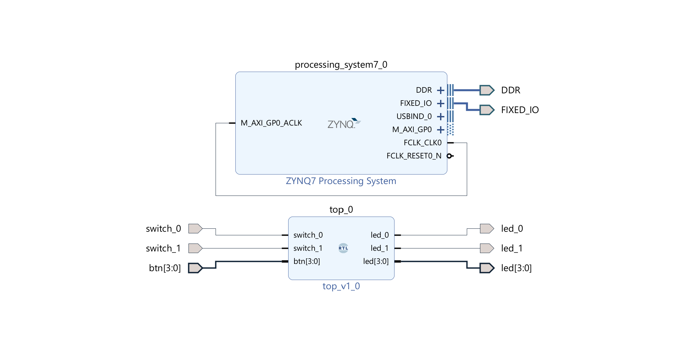

# Project Documentation

[Hardware - PL](./walkthrough/walkthrough.md#walkthrough---fpga)  
[Firmware - PS](./walkthrough/walkthrough.md#walkthrough---firmware)



## Prerequisites

- Xilinx tool-suite
- PYNQ-Z2 board (or ZYNQ XC7Z020 compatible)

## Manifest

```code
pynq_z2_led_switcher/
|-assets/ (fpga source files - merged when creating fpga, fpga board files)
|-docs/
|-firmware/ (Vitis workspace and projects)
  |-led_switcher_app/
  |-led_switcher_app_system/
  |-pynq_z2_pfm/
|-fpga/ (Vivado projects)
|-clean.bat (nukes the fpga and firmware folders)
|-create.bat (creates the fpga and firmware projects, generates the hardware spec)
|-create-firmware.tcl (creates the firmware projects)
|-create-fpga.tcl (creates the fpga project)
|-generate-xsa.tcl (generates the hardware spec)
|-LICENSE
|-README.md
|-TODO.md
```

## Getting Started

### Checkout the project

```sh
> git clone ...
```

### Post checkout - create the projects

The project *should* work straight out of the box  
However you can recreate the entire project by following the [walkthrough](./walkthrough/walkthrough.md)

Generate the fpga and firmware project files

- Windows: open a command prompt in the project root

  ```cmd
  >create.bat
  ```

- Windows Git Bash: open a shell prompt in the project root

- Linux: not yet tested

```sh
  > ./create.bat
  ```

**Note:** The above script

1. Creates a Vivado project
2. Generates hardware specifications for the FPGA and exports an xsa file
3. Generates a Vitis workspace

(This process will take a few minutes to complete)

### FPGA - post-generation fixes

None required

### Firmware - post-generation fixes

Open a Vitis workspace in ./firmware

- _pfm project
  - Update Hardware Specification
    - Navigate to FPGA xsa file
    - (relative paths work in scripts, not the IDE)
  - Build Project
- _application project: Build Project
- _sysproject
  - [walkthrough/Configure Boot Image](./walkthrough/walkthrough.md#vitis---configure-boot-image)

## Notes

The Firmware project supports creating a BOOT.bin image to run standalone off of an SD card

The TUL PYNQ-Z2 board file is included to make this project as self-contained as possible

<https://dpoauwgwqsy2x.cloudfront.net/Download/pynq-z2.zip>
