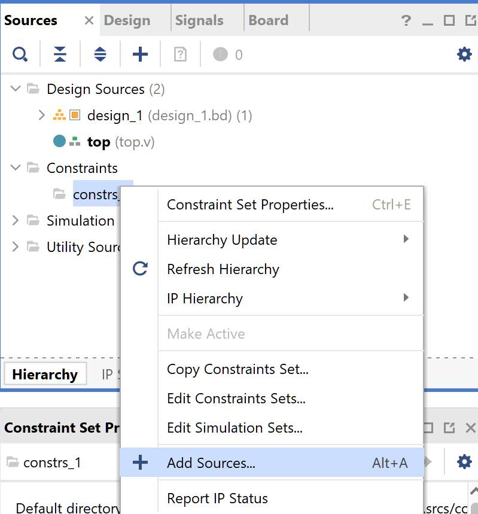
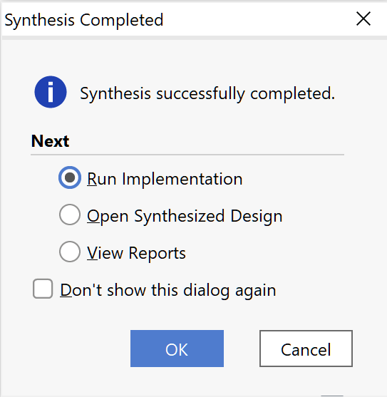

# Walkthrough

- [Walkthrough](#walkthrough)
  - [Xilinx/fpga/Vitis setup](#xilinxfpgavitis-setup)
  - [Project structure and naming conventions](#project-structure-and-naming-conventions)
  - [Start Here](#start-here)
  - [Walkthrough - FPGA](#walkthrough---fpga)
    - [Vivado - Create Hardware Project](#vivado---create-hardware-project)
    - [Vivado - Generate Hardware](#vivado---generate-hardware)
    - [Vivado - Program Device](#vivado---program-device)
    - [Vivado - Export Hardware](#vivado---export-hardware)
  - [Walkthrough - Firmware](#walkthrough---firmware)
    - [Vitis - Create Platform](#vitis---create-platform)
    - [Vitis - Create Application Project](#vitis---create-application-project)
    - [Vitis - Serial Terminals](#vitis---serial-terminals)
    - [Vitis - Create Boot Image Application](#vitis---create-boot-image-application)
    - [Vitis - Configure Boot Image](#vitis---configure-boot-image)
  - [Troubleshooting](#troubleshooting)
  - [Inspiration](#inspiration)

## Xilinx/fpga/Vitis setup

1. Vivado  
   FPGA design and generation
2. Vitis  
   Firmware/Software Applications

## Project structure and naming conventions

```code
$NAME/
|-firmware/ (Vitis workspace and projects)
  |-$NAME_app/ (application project)
  |-$NAME_app_system/ (system project)
  |-$BOARD_pfm/ (platform project)
|-fpga/ (Vivado projects)
|-scripts/ (Project scripts)

$NAME is the name of the project
$BOARD is the board name - e.g. pynq_z2
```

**Note:** When scripting, the system project is generated as $NAME_app_system  
This is not configurable, so prefer underscores to hyphens as separators when naming (aesthetically more pleasing)

**Note:** In Vitis, the app project is inside the system project

e.g. If $NAME is 'led_switcher' and $BOARD is 'PYNQ_Z2' (which becomes 'pynq_z2')

```code
led_switcher/
|-firmware/ (Vitis workspace and projects)
  |-led_switcher_app/
  |-led_switcher_app_system/
  |-pynq_z2_pfm/
|-fpga/ (Vivado projects)
```

## Start Here

**Prerequisites:**

- Xilinx suite is installed
- xsct is on the path
- vivado is on the path

## Walkthrough - FPGA

### Vivado - Create Hardware Project

- Create Project
  - Project name
    - Project location ./$NAME/fpga (create project subdirectory)->Next


- Create Project
  - Project Type
    - -> RTL Project
    - -> Do not specify sources at this time -> Next


- Create Project
  - Default Part
    - Boards -> Pynq-Z2 (make sure to select the board)
  - New Project Summary->Finish


The Project Summary should look like this


- Create Block Design
  - use defaults


- On Diagram
  - Add IP/ZYNQ7 Processing System


- On Diagram
  - Run Block Automation
  - Wire ZYNQ7 FCLK_CLK0->M_AXI_GP0_ACLK
  - Validate Design


- Add Sources/Create File/Create Source File


Click Finish, then OK (the I/O Port definitions will be changed below, click yes when asked to use the default values)

- Open top.v and change the top_0 module

```verilog
module top(
    // components
    input switch_0,
    input switch_1,
    output led_0,
    output led_1,

    input [3:0] btn,
    output [3:0] led

    );
    // wiring
    assign led_0 = switch_0;
    assign led_1 = switch_1;
    assign led = btn;
endmodule
```

- Constraints/Add Sources/Add or create constraints/Create File




- Edit the constraints file

```verilog
set_property -dict { PACKAGE_PIN M20   IOSTANDARD LVCMOS33 } [get_ports { switch_0 }]; #IO_L7N_T1_AD2N_35 Sch=sw[0]
set_property -dict { PACKAGE_PIN M19   IOSTANDARD LVCMOS33 } [get_ports { switch_1 }]; #IO_L7P_T1_AD2P_35 Sch=sw[1]

set_property -dict { PACKAGE_PIN L15   IOSTANDARD LVCMOS33 } [get_ports { led_0 }]; #IO_L22N_T3_AD7N_35 Sch=led4_b
set_property -dict { PACKAGE_PIN G14   IOSTANDARD LVCMOS33 } [get_ports { led_1 }]; #IO_0_35 Sch=led5_b

set_property -dict { PACKAGE_PIN D19   IOSTANDARD LVCMOS33 } [get_ports { btn[0] }]; #IO_L4P_T0_35 Sch=btn[0]
set_property -dict { PACKAGE_PIN D20   IOSTANDARD LVCMOS33 } [get_ports { btn[1] }]; #IO_L4N_T0_35 Sch=btn[1]
set_property -dict { PACKAGE_PIN L20   IOSTANDARD LVCMOS33 } [get_ports { btn[2] }]; #IO_L9N_T1_DQS_AD3N_35 Sch=btn[2]
set_property -dict { PACKAGE_PIN L19   IOSTANDARD LVCMOS33 } [get_ports { btn[3] }]; #IO_L9P_T1_DQS_AD3P_35 Sch=btn[3]

set_property -dict { PACKAGE_PIN R14   IOSTANDARD LVCMOS33 } [get_ports { led[0] }]; #IO_L6N_T0_VREF_34 Sch=led[0]
set_property -dict { PACKAGE_PIN P14   IOSTANDARD LVCMOS33 } [get_ports { led[1] }]; #IO_L6P_T0_34 Sch=led[1]
set_property -dict { PACKAGE_PIN N16   IOSTANDARD LVCMOS33 } [get_ports { led[2] }]; #IO_L21N_T3_DQS_AD14N_35 Sch=led[2]
set_property -dict { PACKAGE_PIN M14   IOSTANDARD LVCMOS33 } [get_ports { led[3] }]; #IO_L23P_T3_35 Sch=led[3]
```

Add source module

- On Diagram
  - right click and add Module


- On Diagram
  - right click on individual control_block_0 connectors and create ports
  - alternatively right click control_block_0 component and select 'Make External' (connector names must be adjusted)
  - Validate design


Now save the block design

- Create HDL
  - Sources/Design Sources/design_1 -> right click -> Create HDL Wrapper (Let Vivado manage...)


### Vivado - Generate Hardware

(Adjust jobs as necessary)

- Run Linter
- Run Synthesis


- Run Implementation



- Generate Bitstream


When complete, View Reports

### Vivado - Program Device

At this point, if the design does not require any firmware/software, the hardware specification can be run on the FPGA  
Connect the board via USB (remove SD card if required, ensure jumpers are set corectly) power switch to ON
**N.B.** the Pynq-Z2 permits programming with jumper config set to SD card (JTAG is not required?)

- PROGRAM AND DEBUG/Open Hardware Manager
  - Open Target/Auto Connect
  - Program device


Move SW0 and SW1, push buttons BTN0-3 to test, the LEDs should light up

### Vivado - Export Hardware

- "Export Hardware Platform" (required for Vitis project)
  - File->Export Hardware
  - Include bitstream
  - XSA file name (leave as default, uses HDL wrapper name), exports to ./fpga by default
- File->Export->Export Hardware
  - Output->Include bitstream->Next
  - (Bitstream out of date - regenerate bitstream ->Yes)
  - Files: (use defaults)->Next->Finish


## Walkthrough - Firmware

Now we create two projects - the platform and the application  
Open Vitis (Eclipse) Workspace, close the Welcome page

### Vitis - Create Platform

- Create Platform: File->New->Platform Project
  - Platform project name $BOARD_pfm
  - Create from XSA (select ../fpga/\*\_wrapper.xsa file (select Generate boot components)->Finish


**Note:** This creates two copies of the .xsa file in the platform project @ ./export/\*platform/hw & ./hw)

- Create Platform - add FAT file system library (xilffs)
  - Select \*.spr file in platform
  - Select bottom Board Support Package in main window
  - -> Modify BSP Settings...
  - select xilffs library -> OK
  - Build Project


### Vitis - Create Application Project

- Create Application Project: File->New->Application Project
  - Use $NAME-platform (as created above)
  - Select a platform from repository-$NAME-platform->Next


- Create Application Project
  - Application Project Details
    - Application project name: $NAME_app
    - System project name: $NAME_app_system
    - Select a System Project->Create new...->Next


- Create Application Project
  - Domain
    - Select a domain->standalone on...
  - Templates->Hello World->Finish


- Build the application

**Note:** As the firmware doesn't interact with the hardware, there is no requirement to change the source code

### Vitis - Serial Terminals

- Window->Show View->Vitis->Vitis Serial Terminal
- Select '+' button in terminal and configure COM port
- Serial port config
  - 115200
  - 8 bit
  - no parity
  - 1 stop bit
  - no flow control
- or use Tera Term

### Vitis - Create Boot Image Application

---

**Reminder:** To prevent a "This application requires xilffs library in the Board Support Package" error

- In Assistant Window, right click Application
- ->"Navigate to BSP Settings"
- -> Modify BSP Settings...
- select xilffs library -> OK (if not already selected from Create Platform steps)
- Build platform and application

---

### Vitis - Configure Boot Image

- In Explorer, right click $NAME_app_system-> Create Boot Image


- We need 3 boot image partitions
  - (bootloader): ./firmware/\$BOARD_pfm/export/\$BOARD_pfm/sw/\$BOARD_pfm/boot/fsb.elf
  - bitstream: ./fpga/fpga.runs/impl_1/\*.bit <-- **Important!** Use the fpga project bitstream to ensure changes stay in synch
  - \$APP.elf: ./firmware/\$APP_app/Debug/\$APP_app.elf
- -> Create Image


**Important!** Use the fpga project bitstream to ensure changes stay in synch

Overwite any existing output files when prompted

Now format an SD card as FAT32 and copy the \$NAME_app_system project BOOT.bin to the SD card

```sh
./firmware/SNAME_app_system/_ide/bootimage/BOOT.bin -> SD:/BOOT.bin
```

(There is another BOOT.BIN file in ./firmware/\$NAME_app_system/Debug/sd_card/, don't use this one!)

**Note:** If the hardware specification (xsa file) has changed, the platform can be updated in Vitis

- right click platform
- Update Hardware Specification
- Build Project

## Troubleshooting

Issues exporting hardware? There could be a lock on the bitstream file

- close vivado
- delete the file
- restart and regenerate

Design changes not reflected in BOOT.bin?  
(test by deleting ./fpga/\*.xsa and checking the file date)  
File->Export->Export Hardware

Remember to update the hardware specification in firmware/\$BOARD_pfm and rebuild the platform

- right click platform
- Update Hardware Specification
- Build Project

## Inspiration

hello world project and workspace  
<https://www.youtube.com/watch?v=Mb-cStd4Tqs>

Vivado project wiring up switches to LEDs  
<https://blog.umer-farooq.com/a-pynq-z2-guide-for-absolute-dummies-part-ii-using-verilog-and-vivado-to-burn-code-on-pynq-d856f79948b1>

Vitis project  
<https://www.hackster.io/news/microzed-chronicles-getting-up-and-running-with-vitis-8f05eb013289>
